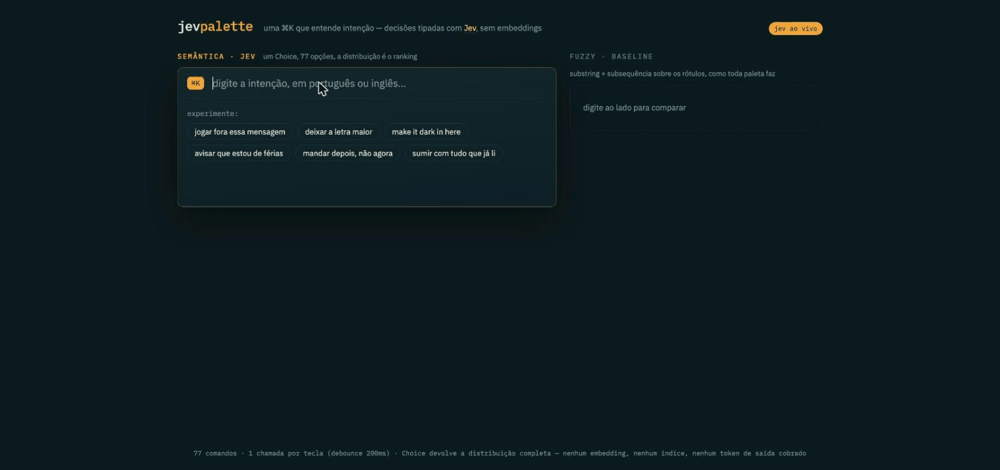

# jev-palette

A semantic command palette (⌘K) demo powered by [Jev](https://typesafe.ai),
TypeSafe AI's System One model. Type your *intent* — in Portuguese or English —
and the palette ranks 77 commands by meaning, side by side with a classic
fuzzy matcher that fails honestly on the same queries.



*"jogar fora essa mensagem" → Delete message · "make it dark in here" → Toggle
dark mode (100%) — while the fuzzy baseline finds nothing.*

## The trick

One `Choice` question per keystroke, with the whole command catalog as options.
Jev returns the **full probability distribution** over all options in a single
~100ms call — the distribution *is* the ranking. No embeddings, no vector
index, no output tokens billed.

```
state:     { query: "jogar fora essa mensagem" }
question:  { type: "choice", instructions: "Which command does the user want?",
             criteria: { delete_message: …, archive_message: …, ×77 } }
answer:    { choice: "delete_message", probabilities: { delete_message: 0.64, … }, confidence: 0.62 }
```

At ~900 input tokens per call and $0.042 per million input tokens, every
keystroke costs about **$0.00004**.

## Running it

```bash
npm install
cp .env.example .env   # put your TYPESAFE_API_KEY in it
npm run dev            # proxy on :8787 + Vite on :5173
```

No key yet? `npm run dev:mock` (or just `npm run dev` without a key) serves a
local keyword-based stand-in so the UI works offline — a "modo mock" badge
shows in the header until the real key is configured.

## Layout

- `server/index.mjs` — tiny Node proxy; keeps the API key server-side, calls
  `POST https://api.typesafe.ai/v1/systemone`, falls back to mock mode.
- `server/jev.mjs` — pure helpers: request building, distribution → ranking,
  cost accounting. Covered by Vitest.
- `src/commands.js` — the 77-command catalog of a fictional mail app, shared
  by browser and server.
- `src/fuzzy.ts` — the deliberately-classic baseline matcher.
- `src/App.tsx` + `src/useJevRank.ts` — React UI: debounced (200ms), aborts
  in-flight calls, caches repeated queries, degrades to fuzzy if Jev is down.

## Tests

```bash
npm test
```

## Schema notes (verified against jev-1.13.0)

A `choice` question takes `instructions` (the decision prompt) and `criteria`
(a map of option id → description); the answer comes back with `choice`,
`probabilities` (floats summing to 1 across every option) and `confidence`.
`rankFromAnswer` in `server/jev.mjs` also tolerates a `distribution` field
name, just in case.
